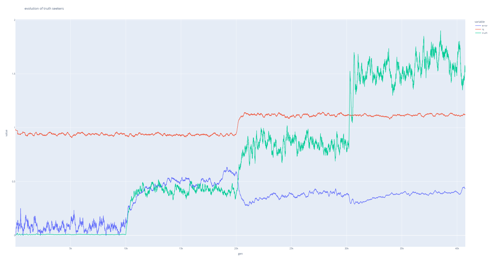

# Evolution of truth seekers

This is just a little experiment I did over a weekend. Not trying to prove or discover anything. Still, thought-provoking.

The model is primitive, oversimplified, unrealistic etc. However, it includes the variables that _I_ personally feel are crucial.

## Population

There is a limited population of 500 individuals who are born, breed, and die. (The population is limited because I'm not studying population growth but other things.)

Every individual has an IQ that is partly (0.6) inherited from average of parents, partly Gaussian random (mean 100, deviation 15).

Mating is random, no assortative matings (maybe will add it to see how it affects things).

## Truth

There is an objective truth in this world. It is just a random string of letters. 

Each individual discovers the next letter of the truth, at random moments, as they live on. Thus, everyone has its own version of truth that they know, which is generally growing in length as they live on.

Also, each individual broadcasts their version of truth at random moments, to its neighbors within a given radius.

Those who hear the broadcast check if it's longer than theirs, and if so, expand their personal truth by taking one next letter from what they heard. 

Both discovering and broadcasting incurs errors: randomly, people mishear and add a different letter to their version of truth.

Your IQ affects how often you discover next letter of truth (+10), how often you broadcast it (+10), and how often you make errors (-10). Also, IQ negatively affects fertility (-5).

(+10 means that there's a +10% change to probability for IQ difference of 1 point)

## History

That's all there is to it! now, the interesting things begin. The world goes through three revolutions.

### 0. PREHISTORIC

Broadcast radius is small (50), so truth does not spread globally. There emerge isolated clusters of truth around high-IQ individuals but they die out without merging. 

The total amount of truth in society (=culture) hovers around 100, with error (share of untruth in what people know) around 0.1.

Curiously, negative effect of IQ on fertility does not result in a long-term trend: the average IQ hovers around 93, even though the IQ of those who breed is 89. This is the power of regression-to-the-mean for you. Only if you make IQ 100% inheritable, it will sink all the way down because of its negative effect on fertility.

### 1. INTERNET

The radius of broadcasting jumps to 250, so you can talk to a lot more people than your immediate family. 

The total amount of truth explodes and stabilizes around 4000.

What's worse, the error also shoots up, and then creeps up more slowly, soon exceeding 0.5. Lots of noise!

### 2. AI OR GENETIC ENGINEERING

This I model as a +10 bonus to everyone's IQ (thanks to AI assistants and/or better genetics). 

Higher IQ means less errors, more discovery of truth, and more broadcasting. As a result, volume of truth doubles to 8000, and the error drops down to 0.3; it then very slowly rebounds to about 0.4 but still stays better than in pre-AI time. 

### 4. LONGEVITY

Length of life increases by 50%. This has a similar effect to the AI revolution, because longer-lived individuals have time to discover and broadcast more truth. The total truth volume doubles again to 15k; error goes down to 0.3 again, but then creeps up to 0.4 again.

## Conclusions

Every revolution shoots up the amount of culture in society, but Internet leads to a disaster in error levels. Noise almost drowns out the signal.

Still, if we survive the stupid-people-with-internet era (current), future developments are more promising as they are likely to suppress the error rate, even though it has a tendency to creep back up after each revolution. We will likely never get to the low error level of pre-internet, but perhaps we can still progress so long as it remains stable and below 0.5 (i.e. truth still outnumbering untruth).

This leaves out a lot of possible factors. Some are negative:

* untruth spreads easier
* untruth corrupts already-learned truth
* AIs act less like IQ boosters and more like the Internet, by parroting whatever they hear; or, worse, are used predominantly to spread untruth
* longevity makes people more prone to untruth as they age
 
Others are likely positive:

* truth spreads easier 
* truth corrects already-learned untruth
* assortative mating
* positive effect of IQ on longevity
* positive effect of the amount of personal truth on IQ

Overall, with the number of moving parts even in this primitive simulation, the system is surprisingly stable, chugging along and finding some kind of equilibrium even in the least favorable conditions.

Here it is graphically: 



Internet happens at 10k, AI at 20k, longevity at 30k. Red is average IQ, green is the total amount of culture, blue is the error level in culture.

## How to run

```
pip install pgzero pandas plotly
```

Then, run 

```
python simulate.py 
```

and watch the movie. Stop it after ~40k generations. It creates a CSV file with results. View it with:

```
python show.py file.csv
```